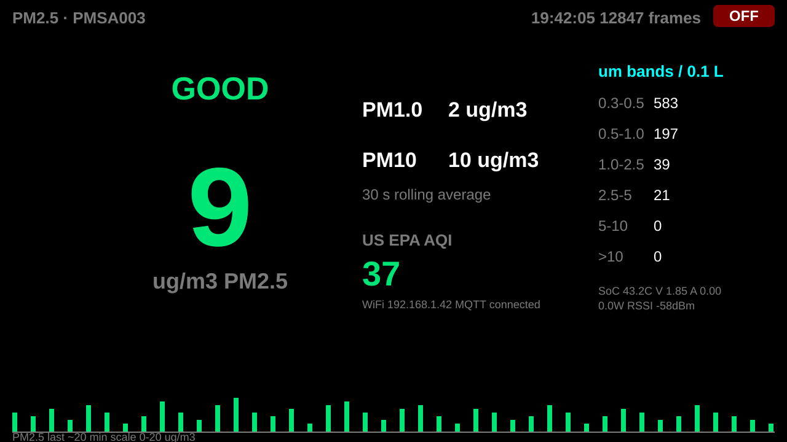
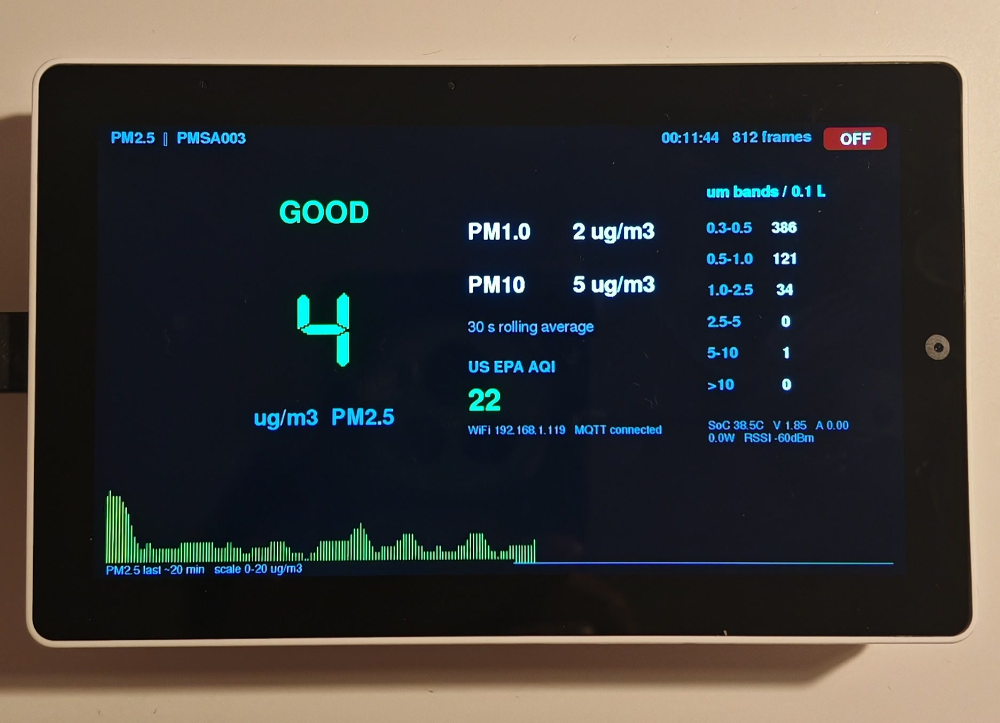
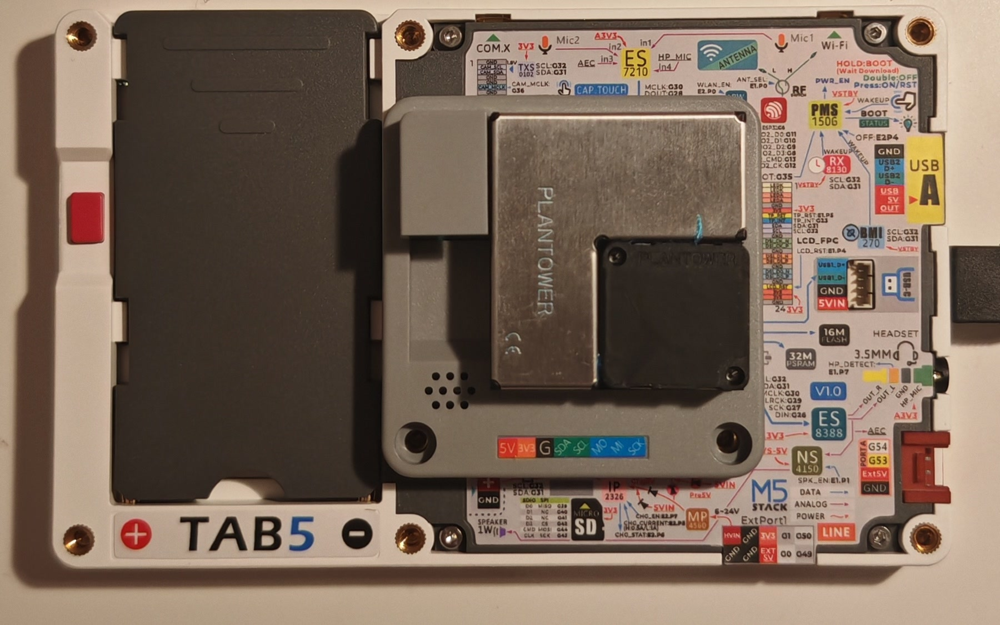

# Tab5 PM2.5 Monitor

**A one-cable, self-healing air quality station built on the M5Stack Tab5 (ESP32-P4) with the Module Air Quality (PMSA003) — with a Home Assistant integration over MQTT.**



*(rendered preview — the live dashboard draws on the Tab5's 5" 1280×720 touch screen; values from a real session)*

The Tab5 shows a live PM2.5 dashboard (30 s rolling average, EPA 2024 color
bands, US EPA AQI), PM1.0/PM10, the six particle-size bands derived from the
sensor's cumulative counts, a ~20-minute history graph, device telemetry
(SoC temperature, battery-rail V/A/W, Wi-Fi RSSI), idle dimming with
touch-to-wake, and a touch OFF button. Every value is published over MQTT
with Home Assistant auto-discovery — the device appears as **"Tab5 Air
Quality"** with 15 sensor entities, no YAML required.

## In real life

| Front — the station running | Back — module stacked on the rear M5-BUS |
|:---:|:---:|
|  |  |

One USB-C cable into the Tab5 powers the whole stack; the sensor takes its
power from the bus (EXT_5V), no second cable, no battery.

## Hardware

| Part | Role |
|---|---|
| M5Stack **Tab5** (C145/K145, ESP32-P4 + ESP32-C6) | host, display, Wi-Fi/MQTT |
| M5Stack **Module Air Quality** (M134, PMSA003) | laser particle sensor, stacked on the rear M5-BUS |
| USB-C wall charger (5 V / 3 A) | the single power source |

The two chips talk over the Tab5's rear M5-BUS — officially compatible per
M5Stack's stack-compatibility table:

| Bus pin | Tab5 GPIO | Function |
|--------:|:----------|:---------|
| 15 | G7 (PC_RX) | PMSA003 UART TX (9600 8N1) |
| 16 | G6 (PC_TX) | PMSA003 UART RX |

## The one-cable, self-healing boot

The Tab5's DSI panel and its Wi-Fi co-processor both initialize during a
window where the 5 V rail is sensitive. A stacked module that runs its fan
from bus power injects a locked-rotor inrush into exactly that window, and
both inits fail — looking for all the world like a firmware bug. This
project's firmware handles it:

1. Panel init fails at boot (geometry 0x0) — detected, not fatal.
2. From ~8 s the sketch retries panel init every 5 s; the rail is steady
   once the fan spins up, so it attaches by ~11 s.
3. Wi-Fi starts **only after** the screen settles, which brings the C6
   co-processor up cleanly — `Wi-Fi connected` + `MQTT connected` by ~25 s.

Cold boot, one USB-C cable, everything alive in ~25 seconds. (Post-flash
boots always work: the fan never loses power, so there is no inrush.)

## Hard-won Tab5 power rules

Documented so nobody repeats this debugging war (details in the sketch
sources):

1. **EXT_5V is software-switched** (`M5.Power.setExtOutput(true)` after
   `M5.begin()`). Without it a stacked module gets no power at all.
2. **A bus-powered module's fan inrush kills panel + C6 init at cold boot**
   (see above). The fan also stalls on weak sources — PC USB ports can't
   start it at all; use a wall charger.
3. **Do not set `cfg.output_power = false`** in `M5.config()` — keep
   M5.begin's default power sequencing.
4. **The battery charger can stay off** — `setBatteryCharge(false)` was
   suspected of killing the display/C6 but was acquitted by re-test; the
   fan inrush was the sole culprit. With no NP-F550 pack the battery rail
   floats ~1.8–1.9 V at 0 A (the official M5Stack app shows the same).
5. **The Reset button soft-resets the main chip only**; the panel/C6 state
   after it is unreliable — restart with a full power cycle instead.
6. **USB serial (CDC) writes block forever** once the TX buffer fills with
   no host reading — guard prints (`Serial.isPlugged()` +
   `setTxTimeoutMs()`), or your device freezes the moment you unplug the PC.

## Software setup

- **Arduino IDE** with the **esp32** board package (3.2+), board:
  **M5Stack Tab5** (USB Mode: *Hardware CDC and JTAG*)
- Libraries (Library Manager): **M5Unified** (display, power manager,
  INA226 battery telemetry) and **PubSubClient** (MQTT)
- Copy `Tab5PM25Monitor/secrets.example.h` → `secrets.h` and fill in your
  Wi-Fi + MQTT credentials (`secrets.h` is git-ignored)
- Open `Tab5PM25Monitor/Tab5PM25Monitor.ino`, Upload, then power-cycle once

### Home Assistant

Any MQTT broker works (Mosquitto on HA is typical). The device publishes:

- `tab5pm25/state` — one retained JSON payload every 10 s (all values)
- `tab5pm25/availability` — `online`/`offline` via MQTT last-will
- `homeassistant/sensor/tab5pm25/*/config` — discovery messages

Sensors: PM2.5, PM1.0, PM10 (µg/m³, proper device classes), US EPA AQI,
six particle bands (per 0.1 L), SoC temperature, battery-rail V/A/W,
Wi-Fi RSSI.

## Repository layout

```
Tab5PM25Monitor/            the station: dashboard, MQTT, self-healing boot
  Tab5PM25Monitor.ino
  secrets.example.h         copy to secrets.h and fill in
Tab5PM25Logger/             serial-only diagnostic instrument
  Tab5PM25Logger.ino
docs/dashboard-preview.svg  rendered preview of the dashboard
docs/Front.jpg              real-life photo, front (running station)
docs/Back.jpg               real-life photo, back (stacked module)
```

Key tunables at the top of the monitor sketch: `FLIP_DISPLAY` (180°
mounting), `IDLE_BRIGHTNESS` / `IDLE_AFTER_MS` (auto-dim),
`ENABLE_BATT_CHARGE` (flip with a battery pack installed).

## License

[MIT](LICENSE)
